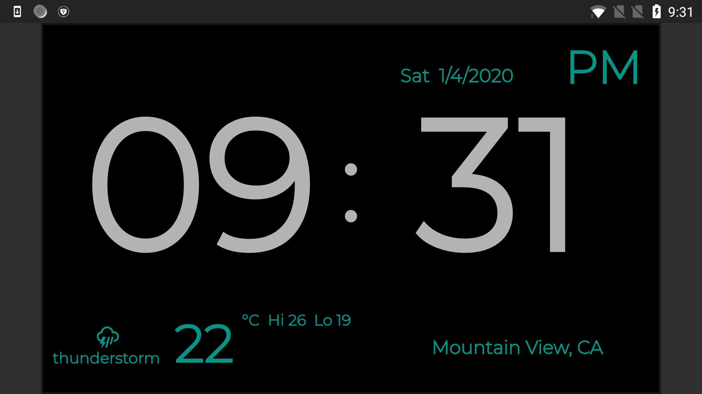
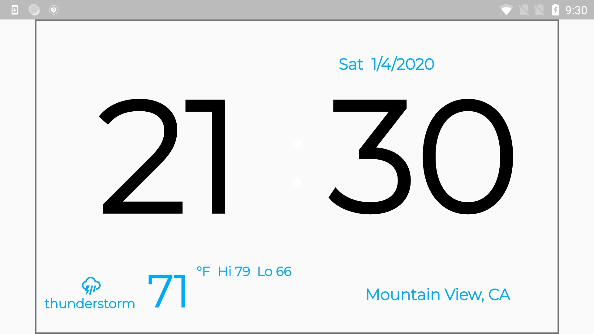

# Digital Clock

This app is a digital clock. It has a light theme and a dark theme. 

1) clock in 24 format or 12 format;
2) animated minute and hour change;
3) location;
4) date;
5) weather condition, temperature, high and low, in celsius and fahrenheit;

See screenshots:

Note: See the [Analog Clock](../analog_clock) if you'd like an example that displays the weather and location.